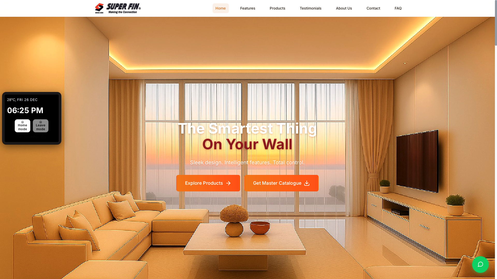
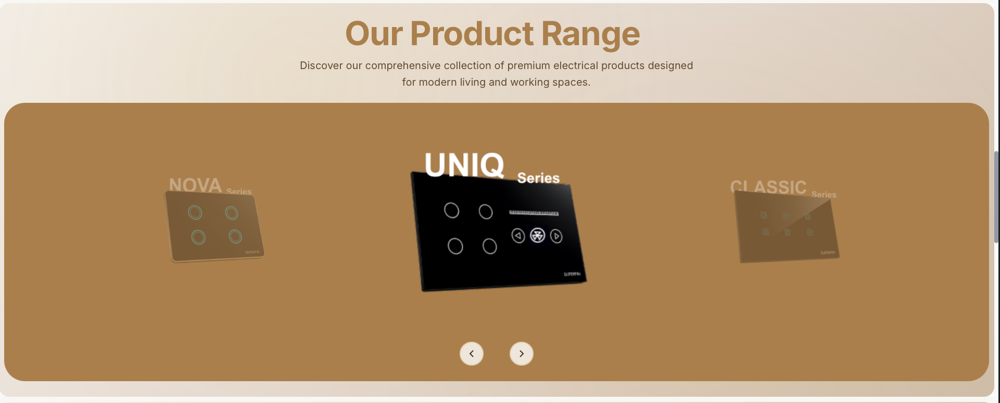
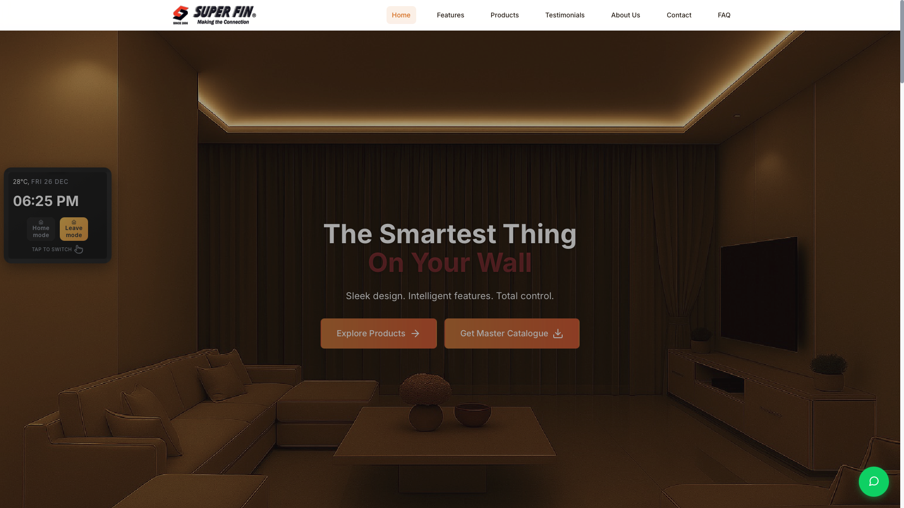

# SuperFin Electric Switches – Official Website

A modern, professional, and fully responsive website built for **SuperFin Electric Switches**, a company manufacturing and selling premium electrical switch solutions.

This project focuses on **clean UI, strong brand presence, performance, and usability** across all devices.

---

## 🌟 Key Highlights

- ✨ Premium, modern UI aligned with brand identity
- 📱 Fully responsive (desktop, tablet, mobile)
- 🎬 Smooth animations and page transitions
- 🧩 Modular, scalable React component architecture
- 🚀 Production-ready frontend built for a real client
- ⚡ Optimized performance with lazy loading and image optimization
- 🔗 Integrated WhatsApp support for instant customer communication

---

## 📸 Screenshots

> **Note:** Add screenshots inside `public/assets/screenshots/` directory and update paths below.

### Homepage


### Products Page


### Mobile View
<p align="center">
  
</p>

---

## 🧩 Features

### 🎨 Design & UI
- Elegant beige and amber gradient theme
- Clean typography and spacing
- Reusable component system with shadcn/ui
- Smooth hover effects and animations powered by Framer Motion
- Glass morphism and gradient card designs

### 📱 Responsiveness
- Mobile-first responsive design
- Adaptive grids and flexible layouts
- Touch-friendly navigation and interactions
- Optimized images for different screen sizes

### ⚙️ Functionality
- Multi-page website with client-side routing (React Router)
- Product catalogue with dynamic series switching
- View brochures (PDFs hosted on S3)
- FAQ accordion with smooth expand/collapse
- Testimonials carousel with auto-scroll
- Contact form with validation
- Floating WhatsApp support button
- Search functionality across products

### 🚀 Performance
- Optimized image loading with lazy loading
- Code splitting for faster initial load
- Production-ready build optimization
- Vercel Speed Insights integration

---

## 📄 Pages & Routes

| Page | Route | Description |
|------|-------|-------------|
| Home | `/` | Hero section, product highlights, and call-to-action |
| Products | `/product/:series` | Product series with switching functionality |
| Testimonials | `/testimonials` | Customer reviews and testimonials carousel |
| About Us | `/about` | Company history and information |
| Contact Us | `/contact` | Contact form and company details |
| Catalogues | `/catalogues` | View product brochures |
| FAQ | `/faq` | Frequently asked questions with accordion |

---

## 🛠️ Tech Stack

### Frontend Framework & Libraries
- **React 18** - Modern UI library
- **React Router v6** - Client-side routing
- **Framer Motion** - Animation library for smooth transitions
- **Lucide React** - Icon library
- **React Icons** - Additional icon support

### UI Components & Styling
- **shadcn/ui** - High-quality component library
- **Radix UI** - Accessible component primitives
- **Tailwind CSS** - Utility-first CSS framework (via PostCSS)
- **Custom CSS Modules** - Component-specific styling

### Development & Deployment
- **React Scripts** - Build tooling
- **Node.js** (v18+) - Runtime environment
- **npm** - Package manager
- **Vercel** - Deployment platform

### Performance & Analytics
- **Vercel Speed Insights** - Performance monitoring
- **Web Vitals** - Core web vitals tracking

---

## 📁 Project Structure

```
superfin-final-web/
├── public/
│   ├── assets/              # Static assets (images, PDFs, SVGs)
│   │   └── screenshots/     # Screenshots for README (add here)
│   └── index.html          # HTML template
├── src/
│   ├── components/          # Reusable UI components
│   │   ├── ui/             # shadcn/ui components
│   │   │   ├── accordion.jsx
│   │   │   ├── button.jsx
│   │   │   ├── card.jsx
│   │   │   ├── input.jsx
│   │   │   └── textarea.jsx
│   │   ├── Navbar.jsx      # Navigation component
│   │   ├── Footer.jsx      # Footer component
│   │   ├── WhatsAppFloat.jsx # Floating WhatsApp button
│   │   ├── ClockCard.jsx   # Product card component
│   │   ├── HorizontalScrollCarousel.jsx
│   │   └── OptimizedImage.jsx
│   ├── pages/              # Page components
│   │   ├── HomePage.jsx
│   │   ├── ProductPage.jsx
│   │   ├── TestimonialsPage.jsx
│   │   ├── AboutPage.jsx
│   │   ├── ContactPage.jsx
│   │   ├── CataloguesPage.jsx
│   │   └── FAQPage.jsx
│   ├── data/               # Static data and content
│   │   └── products.js     # Product data and configurations
│   ├── styles/             # Component-specific styles
│   │   ├── base.css
│   │   ├── HomePage.css
│   │   ├── ProductPage.css
│   │   └── ... (other page styles)
│   ├── App.js              # Main app component with routing
│   ├── index.js            # Entry point
│   └── index.css           # Global styles
├── package.json            # Dependencies and scripts
├── postcss.config.js       # PostCSS configuration
├── vercel.json            # Vercel deployment config
├── start.sh               # Startup script
└── README.md              # This file
```

---

## 🎨 Design System

### Color Palette
- **Primary Gradient**: Amber/Orange (`#f59e0b` → `#f97316`)
- **Background Gradient**: Beige (`#faf9f7` → `#e8e4dd`)
- **Text Colors**: Neutral grays (`#111827` → `#6b7280`)
- **Accent Colors**: Various shades for cards and highlights

### Component Styles
- **Cards**: Multiple variants (gradient, minimal, glass morphism, bordered, shadow)
- **Buttons**: Primary, outline, gradient, and ghost variants
- **Typography**: Clean, readable font hierarchy
- **Spacing**: Consistent padding and margins using Tailwind utilities

### Animations
- Smooth page transitions with Framer Motion
- Hover effects on interactive elements
- Stagger animations for lists and grids
- Scroll-triggered animations

---

## 🚀 Getting Started

### Prerequisites

- **Node.js** (v18.0.0 or higher)
- **npm** (v8.0.0 or higher)

### Installation

1. **Clone the repository:**
   ```bash
   git clone <repository-url>
   cd superfin-final-web
   ```

2. **Install dependencies:**
   ```bash
   npm install
   ```

3. **Start the development server:**
   ```bash
   npm start
   ```

4. **Open your browser:**
   Navigate to [http://localhost:3000](http://localhost:3000)

   The page will automatically reload when you make changes.

### Building for Production

```bash
npm run build
```

This creates an optimized production build in the `build/` directory, ready for deployment.

### Running Tests

```bash
npm test
```

---

## 🔧 Customization

### Adding or Updating Products

Edit the product data in `src/data/products.js`:

```javascript
{
  id: 'product-id',
  name: 'Product Name',
  series: 'Series Name',
  description: 'Product description',
  brochureLink: 'https://s3-url-to-pdf',
  images: ['image1.png', 'image2.png'],
  // ... other properties
}
```

### Updating Content

- **Page Content**: Modify components in `src/pages/`
- **Navigation**: Update routes in `src/App.js`
- **Footer/Contact Info**: Edit `src/components/Footer.jsx`

### Styling

- **Global Styles**: Modify `src/index.css`
- **Component Styles**: Edit files in `src/styles/`
- **Tailwind Config**: Customize via `tailwind.config.js` (if present)

### Environment Variables

For production deployments, you may want to configure:
- API endpoints (if applicable)
- S3 bucket URLs for brochures
- Analytics keys

---

## 🌐 Deployment

### Vercel (Recommended)

The project includes `vercel.json` for easy deployment:

1. Push your code to GitHub/GitLab/Bitbucket
2. Import the project in Vercel
3. Vercel will automatically detect the configuration

### Manual Deployment

1. Build the project: `npm run build`
2. Deploy the `build/` directory to your hosting service
3. Configure your server to serve `index.html` for all routes (SPA routing)

---

## 🌐 Browser Support

- ✅ Chrome (latest)
- ✅ Firefox (latest)
- ✅ Safari (latest)
- ✅ Edge (latest)
- ✅ Mobile browsers (iOS Safari, Chrome Mobile)

---

## 📝 Development Notes

### Key Features Implementation

- **Product Series Switching**: Dynamic routing with URL parameters
- **S3 Brochure Links**: PDFs are hosted on AWS S3 and open in new tabs
- **Responsive Navigation**: Mobile hamburger menu with smooth transitions
- **Form Validation**: Client-side validation for contact forms
- **Image Optimization**: Lazy loading and optimized image components

### Performance Optimizations

- Code splitting for route-based chunks
- Image lazy loading
- Optimized bundle size
- Production build optimizations

---

## 🔒 License

This project is **proprietary and confidential**.

Unauthorized copying, modification, or redistribution is strictly prohibited.

---

## 📞 Contact & Support

**SuperFin Electric Switches**

- 📧 **Email**: simonienterprises@yahoo.com
- 📞 **Phone**: +91 76667 93388
- 💬 **WhatsApp**: +91 76667 93388

For technical support or questions about this website, please contact the development team.

---

## 🙏 Acknowledgments

Built with modern web technologies and best practices for optimal user experience and performance.

---

**Last Updated**: 2024
